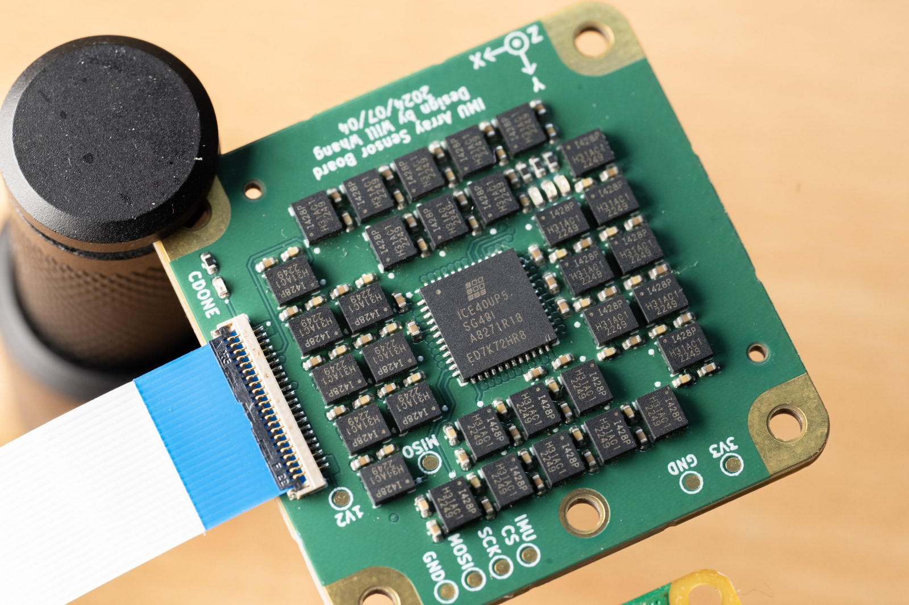
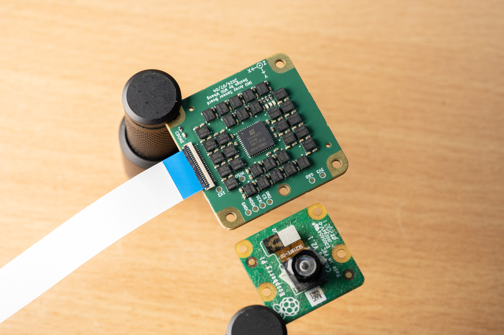

# IMU sensor Array   
Based on 32x ICM-42688-P and ICE40UP5K

## System Block Diagram

## Dictionary Structure

* IMUArray_SensorBoard: KiCad files for the Sensor board
* IMUArray_BreakoutBoard: KiCad files for the Sensor breakout board with Raspberry Pi Pico  
* MicroPythonCode: MicroPython code for Raspberry Pi Pico  
* FPGACode: Verilog files for the FPGA

## Notes
The hardware is specifically designed for JLCPCB's 6-layer board + PCBA servicecs and as you can see from the photos it is using via-in-pad, though I still need to use smaller via dimensions (0.2mm drill) that drive up the cost from their promotional 2 USD PCB (JLCPCB, for anyone using your 6-layer adv. PCB the default 0.3mm/0.45mm is not enough and you should really think about moving to 0.2mm/0.35mm without additional cost for adv. PCB). Gerber, BOM and CPL files are also available.   

Without IMU and ICE40, two boards cost me about 67 USD (37 USD on PCB, 30 USD on PCBA), furthermore I have them populate top side only, the back side are some 0402 decoupling caps that can be easily hand soldered. Do note that the FPC connector is selected because it has the least width, but the plastic latch is way fragile then I though, so becareful.   

As for the breakout board, it is really just for supporting the bring up process, I'm gonna design some other based boards to use this IMU array for my other projects (Geophone replacements).  

The code is still in its early stages so there isn't a lot of "Handy" functions to set different ODR (Sampling rate)/FSR (Full Scale range) and functions, but mostly just hand calculated values for the registers. Rightnow it is set to 200Hz sampling rate with interupt and external 32Khz clock enabled. For the Verilog code, please don't judge, I'm too lazy to save 4096 LUTs for the 512 byte IMU data, I mean for some reason ICE40UP5K is pretty cheap so I might as will to utilized it fully, right?  

Most importantly, the code right now does not do any fancy data processing but only reading out 32x IMU data and either send all of them or do a simple average (accumulating only actually) and output the result (it does handle the 4 different rotations of the IMUs).  

The project is still in developments, and here are the issues:  
1. SPI clock is not stable higher then 5Mhz to the FPGA, work is on-going to move the data shifting posedge from ICE40 internal 48Mhz clock to use SCK directly.  
    UPDATE on 2024/08/04 - This has been resolved, now I can run the SPI at 20Mhz.
2. Currently it is not possible to send out all IMU data at 200Hz, but only the averaged value. The bottleneck is in microPython code to print out the data to USB-CDC.  
   UPDATE on 2024/08/04 - Overclocked to 250Mhz so I can send out 100Hz x32 IMUs data to PC, so the focus now is the algorithm to filter out data.

## Footnotes

ICE40 micropython/circuitpython upload code from:   
https://github.com/skerr92/Oakdevtech_CircuitPython_IcePython  
Which is actually designed for the IcyBlue FPGA Feather board (ICE40 + RP2040 on a Feather board)   
https://www.tindie.com/products/oakdevtech/icyblue-fpga-feather-v2/  

[Interactive BOM](https://htmlpreview.github.io/?https://github.com/will127534/IMU_Array/blob/main/IMUArray_SensorBoard/bom/ibom.html) [(provided by InteractiveHtmlBom)
](https://github.com/openscopeproject/InteractiveHtmlBom) 

Papers and Inspirations:  
1. The inspirations comes from Sony's crazy 16x IMU array board for SPRESENSE, which is so powerfull that is it export controlled.   

https://monoist.itmedia.co.jp/mn/articles/2404/26/news134.html

2. H. Kamata, M. Kimishima, T. Sawada, Y. Suga, H. Takeda, K. Yamashita, and S. Mitani, MEMS Gyro Array Employing Array Signal Processing for Interference and Outlier Suppression, IEEE Inertial 2020, Hiroshima, Japan   
https://ieeexplore.ieee.org/document/9090089   
https://www.kenkai.jaxa.jp/research/innovation/multi_imu.html  
https://www.sony.com/ja/SonyInfo/technology/stories/entries/Spresense/  
This is also what Sony's IMU array board is based of I think.

3. Purely Inertial Navigation with a Low-Cost MEMS Sensor Array by Lukas Blocher et. al  
https://ieeexplore.ieee.org/document/9430468

4. Improving the Navigation Performance of the MEMS IMU Array by Precise Calibration - by Liqiang Wang et. al  
https://ieeexplore.ieee.org/abstract/document/9562518

5. Improving the Measurement Accuracy of the MEMS IMU Array by a New Calibration and Fusion Technology - by Tong Wang et. al  
http://i2nav.com/ueditor/jsp/upload/file/20221125/1669361019644065348.pdf

6. Aligning the Forces—Eliminating the Misalignments in IMU Arrays - by John-Olof Nilsson et. al  
https://ieeexplore.ieee.org/document/6879287
